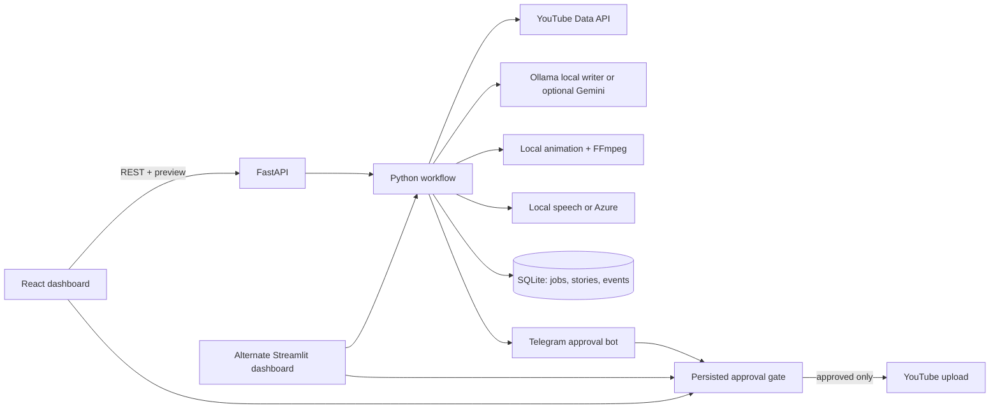

# Project architecture

The product has a Python workflow service, a React review dashboard, and one SQLite database. The channel identity is fixed in code: peaceful, traditional Telugu village serials set in the 1980s.

## Folder map

| Path | Responsibility |
| --- | --- |
| `src/story_video_automation/api.py` | FastAPI routes, authentication, CORS, preview delivery, and serving the production React bundle. |
| `src/story_video_automation/pipeline.py` | Coordinates research, writing, scene generation, narration, editing, and approval handoff. |
| `src/story_video_automation/story_generation.py` | Ollama/Gemini prompt and structured episode generation, including previous-episode context. |
| `src/story_video_automation/story_quality.py` | Deterministic scene, script, continuity, trend-insight, and title checks. |
| `src/story_video_automation/state.py` and `db.py` | SQLite schema, safe migrations, job transitions, and saved workflow records. |
| `src/story_video_automation/approval.py` | Records a human decision and requires persisted approval before upload. |
| `src/story_video_automation/dashboard.py` | Alternate Streamlit interface. |
| `frontend/` | React + TypeScript source, Vite configuration, and reproducible pnpm lockfile. |
| `tests/` | Story quality, API route, and upload approval tests. |
| `.github/workflows/ci.yml` | Python lint/tests and frontend production build on each push and pull request. |
| `docs/` | Setup, privacy, architecture, and deployment notes. |
| `scripts/` | Windows scheduled task install/run helpers. |

## Main request flow

1. The dashboard calls `/api/research`; the server always adds the fixed channel niche to the YouTube query.
2. The dashboard submits up to three research references to `/api/jobs`.
3. The pipeline asks the selected story provider (local Ollama by default) for an original episode and checks its structure before rendering.
4. SQLite stores the series bible, story, scenes, research references, quality report, and job events.
5. The browser polls the job list, requests the MP4 preview, and can send a revision prompt.
6. A reject decision is persisted and ends the job. An approve decision is persisted before the YouTube upload is attempted.

Veo generation remains an optional asynchronous provider; the default renderer uses locally generated illustrations. The quality checks validate structure and exact-title reuse, not literary quality or copyright compliance. A person reviews every preview.
